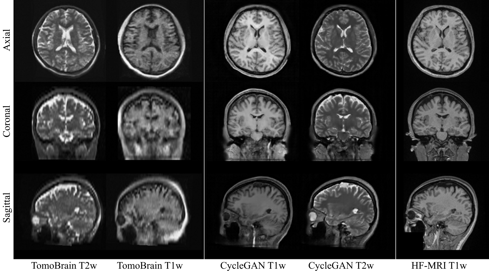

# CycleGAN-3D-ULF

This repository provides a PyTorch-based framework for enhancing ultra-low-field (ULF) MRI using a 3D CycleGAN framework and Residual Vision Transformer (ResViT) generator models. The goal is to translate ULF-MRI volumes into higher-quality images that approximate high-field (HF) MRI while preserving anatomical fidelity for the purpose of downstream brain volume analysis. We provide model pre-training weights from pubicly accessible datasets of low-field (M4Raw; 0.3T) and high-field (HCP; 3T) images as a starting point to then fine-tune on smaller sets of ULF-MRI data:

[Advancing the Reliability of Ultra-Low Field MRI Brain Volume Analysis Using CycleGAN](https://link.springer.com/chapter/10.1007/978-3-031-79103-1_6) \
Hsu P, Marchetto E, Sodickson D, Johnson P and Veraart J \
Meets Africa Workshop, 52-62 (2024)\




----------------

# Installation

1) Clone this repository.

2) Create a virtual environment with conda using the provided environment.yml.
```
conda env create -f environment.yml
```

3) Activate the environment and use the code.
```
conda activate cyclegan_ulf
```

Note: This implementation has been tested with Python 3.10 and Cuda 11.8. Some adjustment may be needed if working with different versions.

----------------

# Model Training / Fine-Tuning

### Data Setup / Folder Structure

The provided framework expects image input and output in the following folder structure:

```
├── ULF                     # Folder for first set of images (ULF in this example)
│   ├── train/              # Can be train, val, or test
│   │   ├── images/         # Contrast and/or Acquisition Direction 1
│   │   ├── images2/        # Contrast and/or Acquisition Direction 2
│   └── ├── .../            # Other images following 'images#' convention
    
├── HF                      # Folder for second set of images (HF in this example)
│   ├── train/              # Can be train, val, or test
│   │   ├── images/         # Contrast and/or Acquisition Direction 1
│   │   ├── images2/        # Contrast and/or Acquisition Direction 2
│   └── ├── .../            # Other images following 'images#' convention
```
For example, images, images2, and images3 folders could correspond to data from T1w axial, coronal, and sagittal directions.

### Training The Model


```
python train.py
```

Some example training, validation, and testing scripts are provided in the scripts/ folder.

----------------

# Citation Information
If you use this code in a publication, please cite the following paper:
[Advancing the Reliability of Ultra-Low Field MRI Brain Volume Analysis Using CycleGAN](https://link.springer.com/chapter/10.1007/978-3-031-79103-1_6)
Hsu P, Marchetto E, Sodickson D, Johnson P and Veraart J \
Meets Africa Workshop, 52-62 \

Please note the Copyright information under the provided LICENSE. 

----------------

# Contact Information
For any questions regarding this code please contact: Peter Hsu \
peter.hsu@nyulangone.org

----------------

### References

